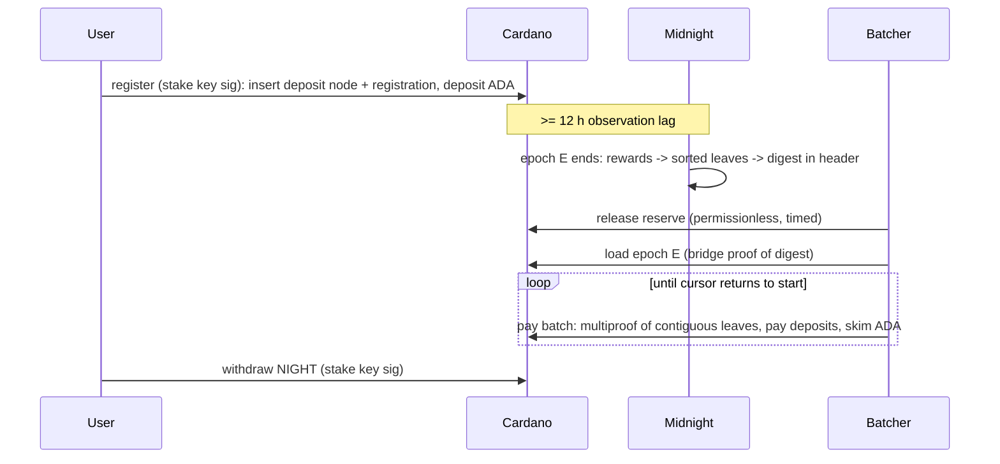

# Block Production Rewards on Cardano — Overview

Status: Draft (design settled in interview 2026-09-03; emission numbers and
digest encoding pending node team). Detailed contract spec: [spec.md](spec.md).
Implementation plan: [`plans/rewards/`](../../plans/rewards/00-index.md).

## What

Midnight block producers (Cardano SPOs) and their delegators earn NIGHT.
Production is observed on Midnight; payment happens on Cardano, in NIGHT,
into per-stake-key **Midnight virtual accounts**. Four on-chain pieces:

| Piece | Role | Upgradable |
|---|---|---|
| **Reserve v2** | Existing reserve, new logic: timed release of NIGHT into the pool under a per-network emission schedule. Permissionless crank, catch-up on missed intervals. | Yes (Forever → Two-Stage → Logic) |
| **Rewards pool** | Holds released NIGHT. Value only leaves via a batcher payout. | Yes (Forever → Two-Stage → Logic) |
| **Batcher state** | One UTXO: current epoch, reward Merkle root, cursor over the sorted leaves. Withdraw-zero validator runs the batch logic once per tx. | No (fixed) |
| **Virtual account** | Per stake key: a **deposit UTXO** (ADA for batcher fees + accrued NIGHT, node in a sorted linked list) and a **registration UTXO** (owner key, DUST address, SPO keys). | No (fixed) |

## Why this shape

- **Pay on Cardano.** NIGHT liquidity is on Cardano; users hold rewards where
  they trade. DUST generation reads these UTXOs the same way it reads cNIGHT
  holdings today.
- **Push, not pull.** A permissionless batcher walks the epoch's sorted
  reward leaves and pays every account. Users never race each other for a
  shared root. Users still withdraw NIGHT any time.
- **Merkle root, not a list.** Midnight emits `(epoch, root, min_key, max_key)`
  per epoch. Any node rebuilds the leaf map from chain state. Cardano stores
  only the root and a cursor.
- **Cursor + random start, not a bitmap.** The batcher picks any leaf as the
  start, pays leaves in key order, wraps from `max_key` to `min_key`, and is
  done when the next leaf is the start again. Each batch proves a contiguous
  run of sorted leaves via one multiproof, so leaves cannot be skipped or
  paid twice. State stays constant size regardless of leaf count.
- **Linked list for uniqueness only.** Deposit UTXOs form a list sorted by
  stake key hash so one account per stake credential holds by construction.
  Payout order does not follow the list; it follows the leaves.
- **Two unlinked UTXOs per account.** Registration edits never contend with
  batcher payouts. Midnight pairs them by stake key hash.
- **Root trust = BEEFY bridge.** The epoch's digest is proven from the
  committee bridge's `latest_mmr_root` (already on chain) through the MMR
  leaf of the following block and that block's parent header. No batcher
  key is trusted.
- **Fees from ADA deposits.** Each paid account is skimmed a flat ADA fee.
  No NIGHT liquidity assumption in the operational layer.
- **Reserve and pool upgradable; accounts and batcher not.** Governance can
  fix the emission side. Governance cannot reach user NIGHT.

## Actors

- **User** (delegator or SPO): registers once with the stake key, tops up
  ADA, withdraws NIGHT, sets `Deregister(addr)` once, edits registration
  with the owner key.
- **Batcher**: anyone. Cranks the reserve release, loads the next epoch with a
  bridge proof, pays batches, performs acknowledged exits. Compensated by
  skims.
- **Bridge relayer**: existing role; advances `latest_mmr_root`.
- **Midnight node / rewards pallet**: observes deposits (12 h stale), computes
  rewards, builds the sorted tree, emits the digest, acknowledges
  deregistrations.
- **Governance** (Council + Tech Authority): upgrades reserve and pool logic.

## Lifecycle

## Key numbers (see spec for config keys)

| Parameter | Value | Note |
|---|---|---|
| Deposit min / cap | 10 / 40 ADA | at register and top-up |
| Skim per paid account | 0.01 ADA | per network config |
| Funded floor (Midnight) | ~3 ADA | pallet parameter; below it no leaf is emitted |
| Observation lag | ~12 h | `k / f` on Cardano |
| Epoch length | 1–2 h (MIP) | settlement cadence |
| Emission | geometric decay per interval | **TBD** with Jon; placeholder in spec |
| Leaf hash | blake2b-256 | **TBD**; abstracted, switchable |

## Latency

User action → visible to Midnight ≥ 12 h → digest at end of the first epoch
after → bridge checkpoint → batcher load + fold. Worst case about 12 h plus
two epochs plus the fold. Payouts always lag at least one epoch behind
Midnight; that is accepted.

## Trust and failure modes

- **Committee**: a dishonest two-thirds can sign a forged digest; theft is
  bounded by the pool balance (flow limit). Detection is reactive.
- **Batcher**: cannot pay wrong amounts, skip, or double pay (proof shape,
  cursor, per-leaf value checks). Can only stall; anyone else resumes.
- **User**: can contend with the batcher only by a full NIGHT withdrawal
  (once per payout), a bounded top-up, or a once-per-lifetime deregister
  flag. Registration churn never touches the deposit.
- **Reserve drift**: schedule runs on Cardano time; if Midnight halts the
  pool fills but nothing pays out. Accepted; it is a flow limit.
- **Deposit ADA**: only ever increases except by skim and exit, so Midnight's
  12 h-stale balance is always ≤ the live balance minus at most a few skims.
  The funded floor keeps every leaf payable.

## Out of scope (now)

- TypeScript CLI, reference batcher, off-chain prover, emulator e2e — planned
  after the on-chain work (`plans/rewards/06-typescript.md`).
- Rewards pallet, digest inherent, epoch length change (midnight-node).
- Digest sharding past ~50k recipients per epoch (cursor design removes the
  bitmap size cap; multiproof size per batch is the remaining limit).
- Pending-balance policy for unregistered recipients (pallet).
