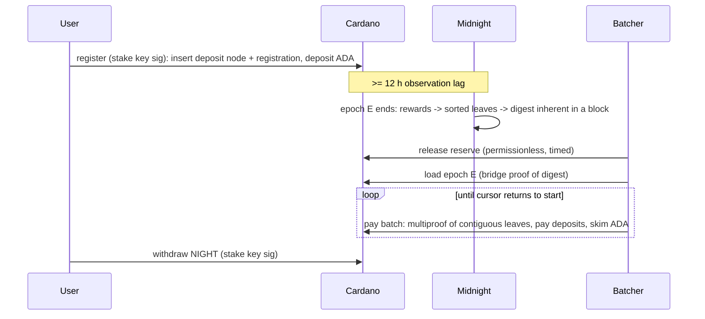

# Block Production Rewards on Cardano — Overview

Status: Draft (design settled in interview 2026-09-03; emission numbers
pending tokenomics, digest layout pending node-team confirmation).
Detailed contract spec: [spec.md](spec.md). Node-side contract and
questions: [node-team-brief.md](node-team-brief.md).
Implementation plan: [`plans/rewards/`](../../plans/rewards/00-index.md).

## What

Midnight block producers (Cardano SPOs) and their delegators earn NIGHT.
Production is observed on Midnight; payment happens on Cardano, in NIGHT,
into per-stake-key **Midnight virtual accounts**. Five on-chain pieces:

| Piece | Role | Upgradable |
|---|---|---|
| **Reserve v2** | Existing reserve, new logic: timed release of NIGHT that fills the pool to one interval's worst-case draw, computed from the live reserve. Permissionless crank, catch-up on missed intervals. | Yes (Forever → Two-Stage → Logic) |
| **Rewards pool** | Holds released NIGHT. Value only leaves via a batcher payout. | Yes (Forever → Two-Stage → Logic) |
| **Batcher state** | One UTXO: current epoch, reward Merkle root, cursor over the sorted leaves. Withdraw-zero validator runs the batch logic once per tx. | No (fixed) |
| **Fee schedule** | One UTXO: Midnight-published `max_skim` per batch size, `dist_fee`, `min_payout`. Replaced only under a bridge proof. Reference input of every batch. | No (fixed) |
| **Virtual account** | Per stake key: a **deposit UTXO** (ADA for batcher fees + accrued NIGHT, node in a sorted linked list) and a **registration UTXO** (owner credential, weighted destinations — DUST address / NIGHT address —, operator keys). User logic runs once per tx in a withdraw handler; mint and spend are gates. | No (fixed) |

## Why this shape

- **Pay on Cardano.** NIGHT liquidity is on Cardano; users hold rewards where
  they trade. The node reads the deposit and the registration's weighted
  `destinations` (a kind byte per entry: DUST-generation address or NIGHT
  address; weights sum to 1000) the same way it reads cNIGHT holdings
  today. Kind semantics belong to the node; the contract only checks the
  weights.
- **Push, not pull.** A permissionless batcher walks the epoch's sorted
  reward leaves and pays every account. Users never race each other for a
  shared root. Users still withdraw NIGHT any time.
- **Merkle root, not a list.** Midnight emits `(epoch, root, min_key, max_key, treasury_total)`
  per epoch. Any node rebuilds the leaf map from chain state. Cardano stores
  only the root and a cursor.
- **Cursor + random start, not a bitmap.** The batcher picks any leaf as the
  start, pays leaves in key order, wraps from `max_key` to `min_key`, and is
  done when the next leaf is the start again. Each batch proves a contiguous
  run of sorted leaves via one multiproof, so leaves cannot be skipped or
  paid twice. State stays constant size regardless of leaf count.
- **Linked list for uniqueness only.** Deposit UTXOs form a list sorted by
  stake key hash so one account per stake credential holds by construction.
  Payout order does not follow the list; it follows the leaves.
- **Two unlinked UTXOs per account.** Registration edits never contend with
  batcher payouts. Midnight pairs them by stake key hash.
- **Root trust = BEEFY bridge.** The epoch's digest is a transaction in a
  Midnight block (`submit_rewards_digest` inherent), proven from the
  committee bridge's `latest_mmr_root` (already on chain) through the MMR
  leaf of the following block and that block's parent header. No batcher
  key is trusted.
- **ADA cost from deposits, NIGHT upside from the leaf.** Each paid
  account is skimmed toward the batch tx fee, capped per account by a
  Midnight-set schedule indexed by batch size; the batcher's own
  input/output pair may not gain ADA. A flat `dist_fee` in NIGHT comes off
  every leaf at or above `min_payout` and stays with the batcher, so
  folding earns in proportion to leaves paid. No exchange rate between
  the two.
- **Reserve and pool upgradable; accounts and batcher not.** Governance can
  fix the emission side. Governance cannot reach user NIGHT.

## Actors

- **User** (delegator or SPO): registers once with the stake key, tops up
  ADA, withdraws NIGHT, sets `Deregister(addr)` once, edits registration
  with the owner key.
- **Batcher**: anyone. Cranks the reserve release, loads the next epoch with a
  bridge proof, pays batches, performs acknowledged exits. ADA cost
  recovered by skims; paid in NIGHT by `dist_fee`.
- **Bridge relayer**: existing role; advances `latest_mmr_root`.
- **Midnight node / rewards pallet**: observes deposits (12 h stale), computes
  rewards, builds the sorted tree, emits the digest, acknowledges
  deregistrations.
- **Governance** (Council + Tech Authority): upgrades reserve and pool logic.

## Lifecycle


```mermaid
sequenceDiagram
    participant U as User
    participant C as Cardano
    participant M as Midnight
    participant B as Batcher
    U->>C: register (stake key sig): insert deposit node + registration, deposit ADA
    Note over C,M: >= 12 h observation lag
    M->>M: epoch E ends: rewards -> sorted leaves -> digest inherent in a block
    B->>C: release reserve (permissionless, timed)
    B->>C: load epoch E (bridge proof of digest)
    loop until cursor returns to start
        B->>C: pay batch: multiproof of contiguous leaves, pay deposits, skim ADA
    end
    U->>C: withdraw NIGHT (stake key sig)
```

## Key numbers (see spec for config keys)

| Parameter | Value | Note |
|---|---|---|
| Deposit min / cap | 10 / 40 ADA | at register and top-up |
| Skim per paid account | ≤ `max_skim[n_paid]` | fee schedule UTXO, Midnight-published; about 0.01 ADA at the target batch size |
| Distribution fee | `dist_fee` per leaf with `amount ≥ min_payout` | fee schedule UTXO; value TBD |
| Funded floor (Midnight) | ~3 ADA | pallet parameter; below it no leaf is emitted |
| Observation lag | ~12 h | `k / f` on Cardano |
| Epoch length | 6 h (committee bridge MIP) | settlement cadence; also the release interval |
| Release | fill the pool to `reserve × (1 − (1 − R)^N)` | `R = 2.8π ÷ γ`, `π` **TBD** |
| Leaf hash | keccak-256 | same family as the bridge |

## Latency

User action → visible to Midnight ≥ 12 h → digest at end of the first epoch
after → bridge checkpoint → batcher load + fold. Worst case about 12 h plus
two epochs plus the fold. Payouts always lag at least one epoch behind
Midnight; that is accepted.

## Trust and failure modes

- **Committee**: a dishonest two-thirds can sign a forged digest; theft is
  bounded by the pool balance (flow limit). Detection is reactive.
- **Batcher**: cannot pay wrong amounts, skip, or double pay (proof shape,
  cursor, per-leaf value checks). Can only stall; anyone else resumes.
- **User**: can contend with the batcher only by a full NIGHT withdrawal
  (once per payout), a bounded top-up, or a once-per-lifetime deregister
  flag. Registration churn never touches the deposit.
- **Reserve drift**: schedule runs on Cardano time; if Midnight halts the
  pool fills but nothing pays out. Accepted; it is a flow limit.
- **Deposit ADA**: only ever decreases by skim and exit, so Midnight's
  12 h-stale balance is always ≤ the live balance minus at most a few skims.
  The funded floor keeps every leaf payable.

## Local demo

The whole flow runs on a local devnet from nothing: the node repo's local-env
on `kc-block-rewards` (a Cardano devnet with db-sync, six Midnight nodes with
the rewards pallet), then this repo's contracts and pump against it.

```bash
just private-net-up      # build the node images if missing, start the stack and the Lace backend
just private-net-deploy  # bridge, rewards contracts, reserve on reserve_logic_v2, one account per operator
just private-net-pump    # land each handover, release, load and pay as it falls due
just private-net-down    # remove the stack and its volumes
```

`private-net-deploy` runs the CLI in `.private-net/demo`, a copy of the
contract compiler's workspace (the pinned contracts, the deployed `local`
profile and the local-env keys); `--use-build` stands in for deployed-scripts
there. Each permissioned candidate's sidechain key comes from the seeds
local-env gives its nodes, and each account gets a new stake key; both land
in `.private-net/demo/.env`. Midnight epochs are one minute, so the pump loads
and pays one epoch a minute.

## Out of scope (now)

- Exits: the pallet emits no `ack = 1` leaf yet, so a committed deposit
  cannot leave; the demo does not deregister.
- Digest sharding past ~50k recipients per epoch (cursor design removes the
  bitmap size cap; multiproof size per batch is the remaining limit).
- Pending-balance policy for unregistered recipients (pallet).
